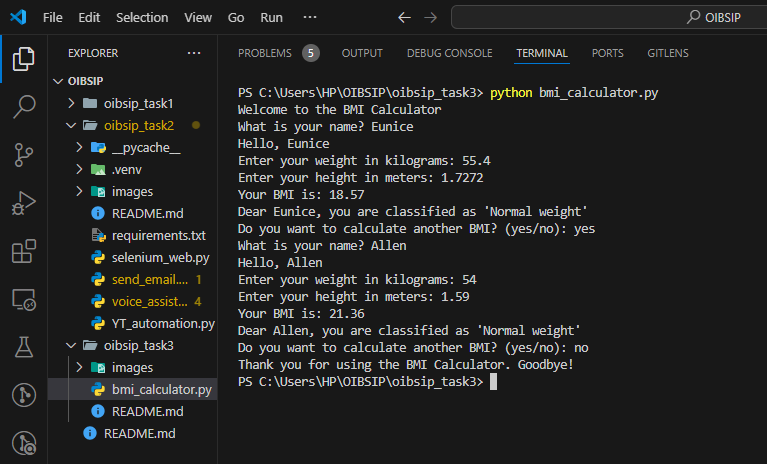

# BMI Calculator

## Project Description

This project is a command-line Body Mass Index (BMI) calculator written in Python. It prompts users to enter their weight (in kilograms) and height (in meters), calculates their BMI, and classifies it into categories based on predefined ranges.



### Features

- User-friendly command-line interface
- Validates user input for weight and height
- Calculates BMI using the standard formula
- Classifies BMI into categories:
  - Underweight: BMI < 18.5
  - Normal weight: 18.5 ≤ BMI < 24.9
  - Overweight: 25 ≤ BMI < 29.9
  - Obesity: BMI ≥ 30

## Key Concepts

- **User Input Validation:** Ensures valid user inputs within reasonable ranges and handles errors gracefully.
- **BMI Calculation:** Accurately implements the BMI formula.
- **Categorisation:** Classifies BMI values into health categories based on predefined ranges.

### Prerequisites

- Python 3.11.5

### Installation

1. **Clone the repository:**

   ```bash
   git clone https://github.com/eadewusic/OIBSIP.git
   cd oibsip_task3
   ```

2. **Run the script:**
   ```bash
   python bmi_calculator.py
   ```

## Usage

1. Open a terminal or command prompt.
2. Navigate to the directory where the `bmi_calculator.py` file is located.
3. Run the following command to start the BMI Calculator:

```bash
python bmi_calculator.py
```

4. Follow the prompts to enter your weight and height.
5. The program will calculate your BMI and display the result along with the BMI category.

## Example

```plaintext
Welcome to the BMI Calculator
What is your name? Emma
Hello, Emma
Enter your weight in kilograms: 70
Enter your height in meters: 1.75
Your BMI is: 22.86
Dear Emma, you are classified as 'Normal weight'
Do you want to calculate another BMI? (yes/no): no
Thank you for using the BMI Calculator. Goodbye!
```

## Contributing

If you would like to contribute to this project, please fork the repository and create a pull request with your changes. Contributions are welcome **only after September 2024**!

## Demo Video

- [YouTube](https://youtu.be/WGevpQAsOmk)
- [TikTok](https://vm.tiktok.com/ZMrmcw6MS/)

## Contact

If you have any questions, feedback, or collaboration requests, please feel free to reach out to me at [euniceadewusic@gmail.com](mailto:euniceadewusic@gmail.com).

## Acknowledgements

This project is a simple yet effective tool to help users understand their BMI and its classification. It is intended for educational purposes and should not be used as a substitute for professional medical advice.

Below are the list of resources I used for this project, in APA7 Citation style:

- Calculator.net. (2019). BMI Calculator. Calculator.net. [https://www.calculator.net/bmi-calculator.html](https://www.calculator.net/bmi-calculator.html)
- Wikipedia. (2024, July 10). Body mass index. Wikipedia. [https://en.wikipedia.org/wiki/Body_mass_index#Categories](https://en.wikipedia.org/wiki/Body_mass_index#Categories)
