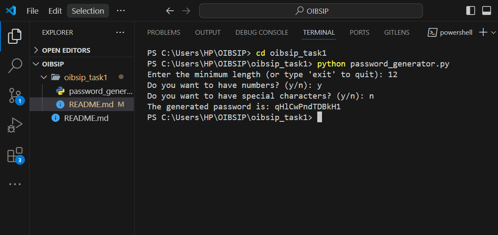

# Random Password Generator

This project is a command-line tool that generates random passwords based on user-specified criteria. It aims to help beginners learn Python by incorporating concepts such as randomisation, user input validation, and character set handling.



## Features

- **Random Password Generation:** Create passwords with a specified length and character set.
- **Character Types:** Include uppercase and lowercase letters, numbers, and symbols.
- **User Input Validation/ Error Handling:** Ensures valid input for password length and character types.

## Getting Started

### Prerequisites

- Python 3.11.5

### Installation

1. **Clone the repository:**

   ```bash
   git clone https://github.com/eadewusic/OIBSIP.git
   cd oibsip_task1
   ```

2. **Run the script:**
   ```bash
   python password_generator.py
   ```

## Usage

1. **Specify the password length:**

   - When prompted, enter the desired length of the password.

2. **Select character types to include:**

   - You will be asked whether to include numbers or special characters. Enter 'y' for yes and 'n' for no.

3. **Get the generated password:**
   - The script will generate and display the password based on your specifications.

### Example

```
Enter the minimum length (or type 'exit' to quit): 12
Do you want to have numbers? (y/n): y
Do you want to have special characters? (y/n): n

The generated password is: qHlCwPndTDBkH1
```

## Code Overview

### `password_generator.py`

- **Imports:**

  - `random`: For generating random characters.
  - `string`: For accessing different character sets like lower and uppercase letters, numbers or digits or special characters.
  - `sys`: To use the `sys.exit()` function to exit the python program for enhanced user experience.

- **Functions:**
  - `generate_password()`: Generates the password using the validated inputs.

## Learning Objectives

1. **Randomisation:**
   - Using the `random` module to generate random characters.
2. **User Input Validation:**
   - Ensuring the user inputs a valid password length and selects at least one character type.
3. **Character Set Handling:**
   - Managing different character sets (letters, numbers, symbols) and combining them based on user preferences.
4. **Error Handling:**
   - Ensuring that user input is the correct spelling, meets our set criteria and has minimum length > 0.

## Demo Video

- [YouTube](https://youtu.be/7uCQfN4d4Bk?si=lZhU2vQxZsxK-IAf)
- [TikTok](https://www.tiktok.com/@climiradiroberts/video/7378191496161365253?_t=8n3J68HrTwT&_r=1)

## Contact

If you have any questions, feedback, or collaboration requests, please feel free to reach out to me at [e.adewusi@alustudent.com](mailto:e.adewusi@alustudent.com).
